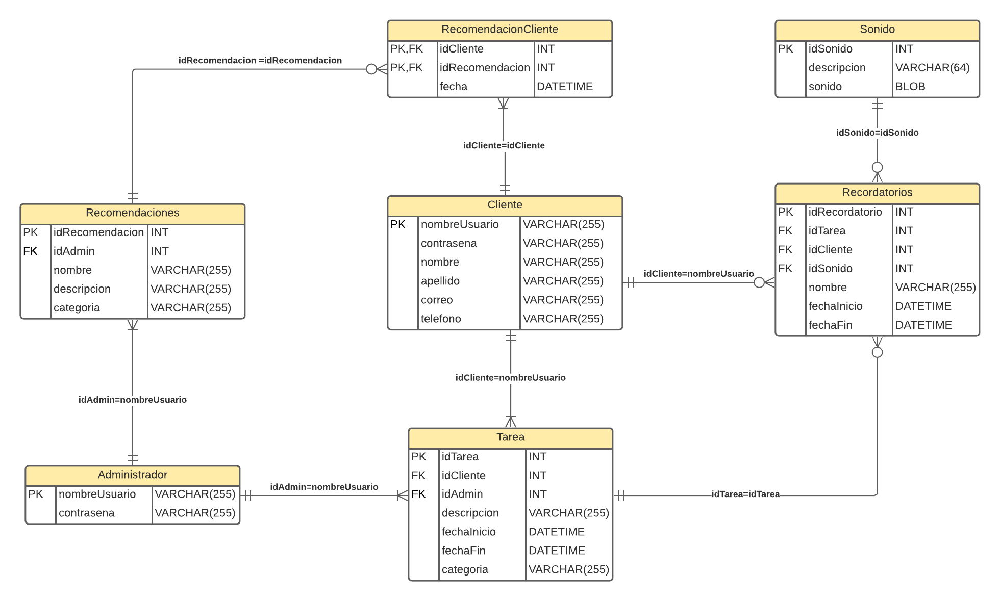

# Proyecto Bases de Datos 

Proyecto de la materia Bases de Datos, ESPOL

## Modelo Lógico

## Evidencia

- [Modelo Conceptual](./evidencias/modelo_conceptual)
- [Modelo Lógico](./evidencias/modelo_logico)
- [Diccionario Datos](./evidencias/diccionario_datos)
- [Consultas Álgebra Relacional](./evidencias/consultas_algebra)
- [SQL](./evidencias/sql)
